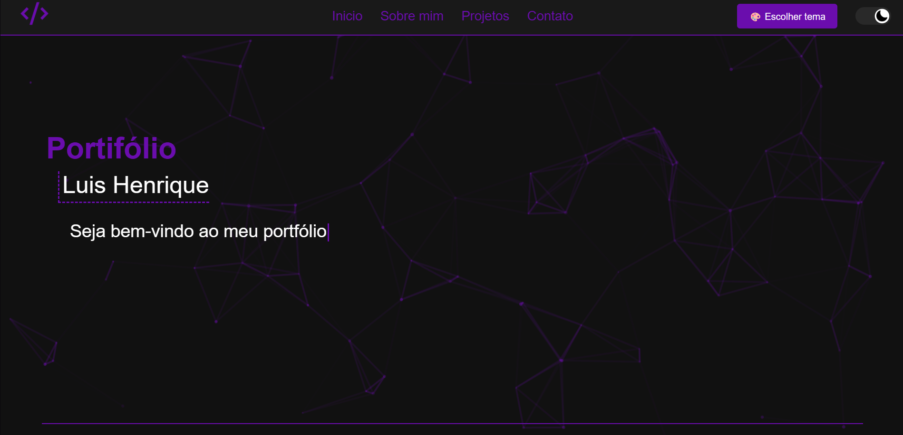

<h1 align="center">Portifólio - Luis Henrique 💻</h1>

<h4 align="center"><a href="https://luhenr1que.github.io/Portifolio">Confira o projeto aqui</a></h4>

---

## 💻 Sobre

Projeto feito no intuito de me apresentar, como desenvolvedor web front-end.

## 🧠 Tecnologias utilizadas:

O site **ainda está em evulação constante**, pois estou em constante aprendizado. Mas até aqui utilizei as tecnologias:

    
    
    

